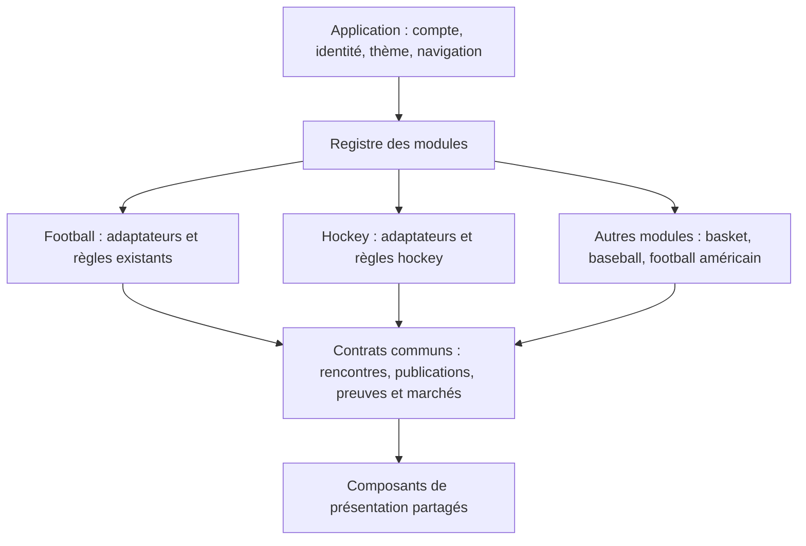

# Architecture multisport — cadrage et socle du 4 octobre 2026

Statut : implémentation locale sur `codex/multisport-hockey`. La branche a intégré
`main` à `61503be` (merge `dcbf3cf`), avec le calendrier football de 14 jours et
les corrections de snapshot/live. Aucun collecteur hockey déployé en production.

**Composants communs et sept ligues :** [audit du 4 octobre](../audits/multisport/2026-10-04-hockey-shared-ui.md).

**Lectures communes et variantes par discipline :** le [cadrage du 5 octobre](multisport-reading-catalog.md)
classe les 28 lectures football existantes, identifie les candidats hockey et
précise les contrats et prérequis de données avant leur activation.

**Formats des championnats hockey :** l'[étude des règles par compétition et saison](hockey-competition-rules-study.md)
analyse les sept ligues, les classements de division/conférence, les oppositions
entre groupes, les phases et les conditions de comparaison pour les lectures.

**Premières lectures fonctionnelles :** l'[itération du 5 octobre](../audits/multisport/2026-10-05-functional-hockey-readings.md)
raccorde trois lectures au compact hockey et aux préférences explicites,
isolées par compte/invité et discipline. Les calculs football restent identiques.

**Étape suivante réalisée :** la [première collecte NHL locale](nhl-first-collection.md)
relie des réponses API réelles au brut, au compact et à l’affichage. Le raccordement
Supabase est préparé et testé en base embarquée, mais pas installé en production.
Les sections backend ci-dessous décrivent la trajectoire générale de migration.

## Décision

Une application, un compte et un système de thèmes ; plusieurs modules métier.
Le module football conserve son pipeline publié. Le module hockey fournit ses
propres règles. Le basket, le baseball, le football américain et un autre sport
pourront ajouter leur module au registre.

Une configuration typée décrit les capacités, fenêtres, fournisseur, budget,
ordre d’affichage et catalogue des lectures/scénarios. Les calculs restent du
code testé dans chaque module. Un fichier JSON qui contiendrait tous les
algorithmes sportifs serait difficile à vérifier et à faire évoluer.



## Répartition du code

| Couche | Responsabilité | Ce qu’elle doit ignorer |
| --- | --- | --- |
| `core/sports` | Identités, contrats de publications, lecture et validation du flux, stockage par sport, scores et périmètres des marchés | API-Football, API-Hockey, barèmes, seuils analytiques et pages métier |
| `features/football` | Configuration et pont vers le repository football existant | Algorithmes hockey |
| `features/hockey` | Contexte hockey, barèmes, moteur, cibles de compétitions et présentation spécifique | Modèles et moteurs football |
| `app/sports` | Composition des modules, pages et sources ; raccordement à l’injection existante | Détails des règles d’analyse |
| Widgets partagés | Affichage de faits et résultats d’analyse déjà préparés | Détection sportive et appels fournisseur |
| Backend commun à construire | File, leases, curseurs, quotas, persistance, publication et observabilité | Champs bruts particuliers d’un fournisseur |
| Adaptateur backend par sport à construire | Routes, normalisation, capacités réellement couvertes, règles de résultat | Préférences et apparence d’un utilisateur |

Le routeur utilise `/sports/:sport`, résolu par le registre. Les URL inconnues
ont un état navigable et un retour au football. Un sport à venir a sa propre
page ; il ne passe plus dans la page hockey. `/` reste le point d’entrée du
football et conserve le parcours de connexion existant.

Ajouter un sport consiste à fournir sa définition, ses adaptateurs, son moteur,
son présentateur et son enregistrement dans la composition. `SportId` est une
clé extensible plutôt qu’une énumération fermée. Un test enregistre un module
volley supplémentaire sans modifier le routeur ou la liste des sports intégrés.

## Contrats implémentés et raccordement réel

- `SportModuleDefinition` et `SportModuleCatalog` : configuration validée,
  unicité des clés, fenêtres cohérentes, scénarios reposant sur des lectures
  implémentées. Les fonctionnalités à l’étude restent identifiées comme telles.
- `SportFixture` : identités qualifiées, compétition, saison, domicile,
  extérieur, horaire, statut et scores par périmètre. Les statistiques détaillées
  restent dans le modèle du sport ; pas de modèle universel rempli de champs nuls.
- `SportSnapshot<T>` : publication immuable, version de schéma, date de collecte
  et fenêtre inclusive indépendante du nombre de matchs.
- `SportFeedRepository` et `ValidatedSportFeedRepository` : port de lecture et
  validation partagée. Une publication vide valide est distincte d’une source
  absente, d’une publication ancienne ou d’une date non couverte. Le calcul
  d’ancienneté utilise l’heure actuelle, pas le jour futur sélectionné.
- `FootballSportFeedAdapter` : branchement sur le repository football existant,
  sans recalculer les lectures. Un test utilise le compact de 14 jours existant
  et conserve les équipes, horaires, rencontres sans cote et données originales.
- `SportReadingEngine<Context>` : interface typée ; le premier moteur hockey
  l’implémente avec son propre contexte et sa version de règles.
- `SportMarketQuote` : identité de sélection incluant sport, rencontre, marché,
  périmètre de règlement et ligne. Une cote à 60 minutes ne remplace pas une
  cote incluant les prolongations.
- `ScopedSportPersistence` : réutilise la frontière compte/invité existante.
  Les ressources hockey ont leur espace ; les clés football conservent exactement
  leur format actuel. Aucune préférence n’est copiée implicitement entre sports.
- `SportWorkspaceRegistry` : composition injectable des espaces et des sources.
  La source football est raccordée au loader existant à la demande ; la source
  hockey utilise une publication locale validée indépendante du football. Sans
  source configurée, elle renvoie `notConnected`, sans tenter de charger du football.

### Limite actuelle à conserver en tête

Le parcours football de production utilise encore ses composants et moteurs
historiques pour les moteurs et profils. Les cartes, le détail, les tables, le
TAT, les accordéons pays/ligue et les composants de présentation du Radar sont
maintenant communs. Le calendrier, les classements, la forme et le H2H hockey
sont raccordés à la collecte locale. Trois lectures personnalisées et leurs
préférences sont maintenant raccordées, avec persistance locale par utilisateur
et sport. Leur synchronisation Supabase, les tickets et bilans hockey restent
à réaliser. Les nouveaux contrats de scores et
marchés ne sont pas encore des adaptateurs de cotes du fournisseur.

Cette itération sécurise les frontières et la composition ; elle ne prétend pas
que tous les écrans et tous les workers sont déjà génériques. Le prochain travail
utilisera ces interfaces, puis extraira les widgets réellement identiques lors
du branchement du premier flux hockey, sans copier toute la feature football.

## Identités, données et isolation

Une identité est `(sport, fournisseur, type d’entité, identifiant fournisseur)`.
Le match hockey 123 et le match football 123 sont deux objets distincts. Les
compétitions, équipes et joueurs suivent la même règle. Les noms affichés ne
servent pas de clé. Le constructeur d’une rencontre refuse les équipes issues
d’un autre sport ou fournisseur.

Les données de rencontres restent publiques ; profils, favoris, tickets,
scénarios actifs et préférences restent privés et rattachés au compte et au
sport. Un compte peut partager son thème, sa langue et son identité entre sports,
mais pas automatiquement ses lectures ni ses compétitions sélectionnées.
Les futures opérations asynchrones de personnalisation devront être invalidées
à la fois au changement d’identité et au changement de sport, comme le fait
actuellement le token d’opération pour l’identité football.

L’ordre de présentation est une politique : domicile/extérieur pour le football,
extérieur/domicile pour le hockey demandé. Les champs `home` et `away`, les
scores et les sélections de marché ne sont jamais inversés en base. Les futures
cartes et le H2H afficheront explicitement le domicile et l’extérieur.

Un score final ne permet pas d’inventer un score à la fin du temps réglementaire.
Un score courant n’est pas une preuve de règlement : un verdict attend un statut
terminé et le résultat correspondant au périmètre du marché.

## Backend et Supabase : architecture cible, pas encore déployée

### Pipeline commun

```text
Demande de collecte (sport + fournisseur + compétition + saison + fenêtre)
  → File et budget du contrat fournisseur
  → Collecte brute par adaptateur
  → Normalisation propre au sport
  → Moteur de lectures avec version de règles
  → Publication compacte validée
  → Lecture publique du sport et du jour demandés
  → Présentation + personnalisation privée
```

Le calendrier n’attend pas une cote pour afficher une rencontre. Une journée
sans match publie une fenêtre vide valide. Une erreur fournisseur ne constitue
pas la preuve qu’il n’y avait aucun match. Une publication incomplète ou mal
identifiée ne remplace pas silencieusement les données par celles d’un autre sport.

Le backend commun devra exécuter des interfaces de module `collect`, `normalize`,
`analyze`, `compact` et `settle`. Les collecteurs football existants seront
raccordés par un adaptateur, progressivement ; aucun déplacement ou renommage de
leurs tables n’est nécessaire pour installer d’abord le hockey.

### File et budgets

La file future identifie les tâches par sport, fournisseur, compétition, saison,
jour, type et étape. Un curseur persistant permet de reprendre la pagination et
les enrichissements. Les tokens de stage, leases, heartbeat, reprise et arrêt
restent dans l’exécuteur partagé. Une étape n’est validée qu’une fois son travail
et sa publication confirmés ; les relances sont idempotentes.

Les quotas sont attachés au **contrat fournisseur**, pas à l’utilisateur et pas
à une simple URL : `api-football` (75 000/jour, plafond applicatif 280/minute) et
`api-hockey` (7 500/jour, marge applicative 280/minute sur les 300 observées dans
l’audit). Cette configuration Flutter décrit la politique ; les réservations
atomiques hockey devront être implémentées côté serveur avant les collectes.
Elle ne constitue pas un contrôle de quota en production.

Le compteur ne doit pas être dupliqué entre live et batchs d’un même contrat.
Le live et la collecte quotidienne partagent le budget de leur fournisseur ;
les appels ne dépendent pas du nombre de personnes qui consultent l’application.
Si un futur contrat partage les quotas de plusieurs sports, ils pourront utiliser
la même `quotaKey`. La concurrence et les priorités devront respecter ce partage.

Le budget de 7 500/jour est une limite, pas une preuve que toute fréquence de
collecte rentrera dedans. Le premier branchement mesurera les pages, les jours
avec des cotes, le H2H, les statistiques et les appels live pour les sept ligues.
Le cache historique et le renouvellement quotidien des cotes réduiront les appels.

### Persistance proposée

Rester dans le projet Supabase actuel pour cette première intégration. Ajouter
un schéma logique commun aux **nouvelles** publications, avec `sport_key`,
`provider_key`, compétition, saison, fenêtre, version de schéma, version de règles,
référence au brut, statut de validation et dates de collecte/publication.

Les collectes brutes gardent leur payload fournisseur et leur provenance. Les
publications compactes n’exposent que les données consommées par le front. Les
clés/index et les politiques RLS incluent le sport ; les préférences privées
incluent aussi `auth.uid()`. La lecture publique filtre la discipline et la date.
Un index sur sport/compétition/fenêtre/date de publication évite de charger tous
les sports pour une seule consultation.

Conserver les tables football jusqu’à ce que leur adaptateur et leurs tests de
contrat permettent une migration contrôlée. Ne pas créer une copie complète des
tables, des fonctions et de l’admin pour chaque sport. Les détails sportifs peuvent
être des payloads versionnés propres au module, avec colonnes communes indexées.

Aucune migration SQL n’est livrée dans cette itération : il faudra concevoir les
index, RLS, références et budgets avec le premier collecteur hockey, puis tester
collecte → brut → compact → lecture anonyme/authentifiée → affichage réellement.
Les tests Dart actuels ne remplacent pas cette future vérification Supabase.

## Hockey : périmètre demandé

IDs issus de la réponse fournisseur conservée dans l’audit du 4 octobre 2026.
Les compétitions ci-dessous sont des **cibles**, pas des jobs de collecte actifs.
La ligue russe est interprétée comme KHL et la française comme Ligue Magnus.

| Compétition | Pays/zone du fournisseur | ID API-Hockey |
| --- | --- | --- |
| NHL | USA | 57 |
| AHL | USA | 58 |
| KHL | Russie | 35 |
| Extraliga | République tchèque | 10 |
| Ligue Magnus | France | 18 |
| Liiga | Finlande | 16 |
| SHL | Suède | 47 |

Chaque compétition devra avoir un profil de règles **par saison et phase** :
barème, durée, prolongations/tirs au but, classement comparable, saison régulière,
présaison/playoffs et périmètres des marchés. Le NHL n’est jamais un barème par
défaut pour une compétition inconnue. L’audit montre que certains agrégats
fournisseur mélangent présaison et saison régulière : l’adaptateur devra filtrer
ces phases avant toute lecture ou classement.

Les lectures hockey existantes sont des hypothèses versionnées à calibrer ; la
fondation ne les transforme pas en règles sportives validées pour les sept ligues.

## Ordre des prochaines étapes

1. Valider localement ce socle et sa non-régression football.
2. Connecter une publication NHL réelle, avec home/away, statut et scopes de
   scores ; vérifier les capacités de chaque endpoint.
3. Ajouter la file/budget hockey et la publication Supabase avec test public de
   bout en bout ; traiter la journée vide et le passage de minuit.
4. Raccorder les widgets communs, préférences, H2H/timeline, lectures et bilan.
   Extraire les présentateurs partagés sans déplacer les calculs sportifs dans l’UI.
5. Valider les profils de règles des six autres ligues, puis les activer une à une.
6. Mesurer coûts/volumes et calibrer les lectures avant la fusion sur main.

## Tests qui protègent cette frontière

- Nouveau module arbitraire et navigation sans modification du routeur.
- URL inconnue et sport à venir sans page hockey de secours.
- Rejet de collisions de modules et scénarios dont les lectures ne sont pas prêtes.
- Isolation des publications et des identités d’équipes.
- Ordre d’affichage hockey sans inversion des scores.
- Identité distincte des marchés selon leur périmètre.
- Clés existantes football, isolation hockey entre comptes et invités.
- Publication vide couverte, fenêtre de 14 jours, vieillissement à l’heure réelle.
- Compact football existant consommé par l’adaptateur commun sans altération.
- Budgets et cibles hockey cohérents avec l’audit capturé.
- Interdiction des imports football dans le domaine commun et le module hockey.
- Suite Flutter complète et tests Deno football avant toute livraison de branche.

### Résultat local de cette itération

- Suite complète : 626 tests Flutter réussis, 2 tests d’intégration ignorés
  (environnement dédié non fourni).
- Tests des fonctions partagées : 27 tests Deno réussis.
- `flutter analyze` : aucune anomalie.
- `dart format --set-exit-if-changed .` : aucune modification attendue.
- Aucun appel hockey supplémentaire, aucune migration ou mise en production.

### Radar joueurs commun

La présentation joueurs est dans `core/widgets/lector_player_radar.dart` :
ligne classée, cellules, matrice, période, légende et identité du signal.
Football et hockey consomment ces classes avec leurs adaptateurs. Le contrat
`SportPlayerProfile` décrit les contributions factuelles, sans inventer présence
ou minutes manquantes. Le hockey collecte les événements des trois derniers
matchs d'équipe dans le cache partagé de l'enrichissement, puis applique son
ranker dans son module. Le lecteur public valide la couverture, la phase, la
saison, les identités et la fenêtre avant d'exposer ces profils à l'écran.
