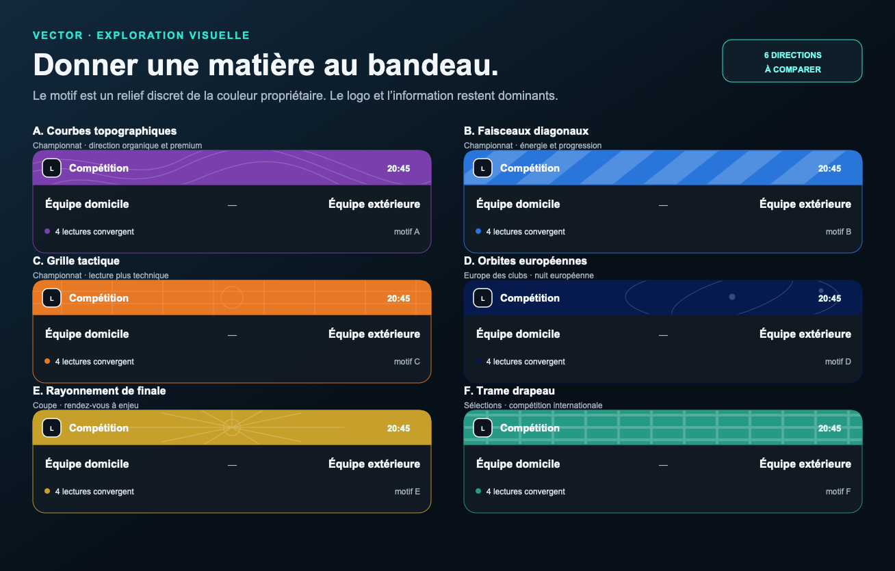

# Exploration des motifs de bandeau

Le logo de la compétition, son nom et l’heure restent au premier plan. La texture est placée sous un voile sombre : elle enrichit le bandeau sans devenir une image de fond ni dégrader la lisibilité.

| Variante | Motif | Couleur d’exemple | Usage de démonstration |
| --- | --- | --- | --- |
| A | Courbes topographiques | `#7A3FAC` | Championnat · direction organique et premium |
| B | Faisceaux diagonaux | `#2975D9` | Championnat · énergie et progression |
| C | Grille tactique | `#E87924` | Championnat · lecture plus technique |
| D | Orbites européennes | `#071A4D` | Europe des clubs · nuit européenne |
| E | Rayonnement de finale | `#C7A02C` | Coupe · rendez-vous à enjeu |
| F | Trame drapeau | `#269A85` | Sélections · compétition internationale |

## Règles communes

- La couleur propriétaire vient du registre de compétition.
- Le motif est vectoriel, sans requête réseau ni asset spécifique à une rencontre.
- Son opacité est plafonnée afin que le logo et les informations restent lisibles.
- Le cadre et la cartouche conservent leur rôle propre ; le bandeau ne les remplace pas.
