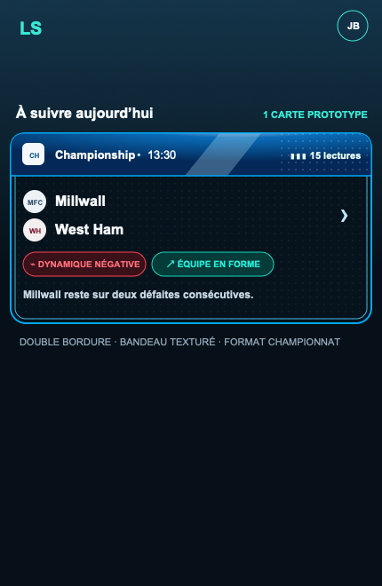

# Prototype réel — carte de championnat

Prototype à l’échelle mobile de la carte de liste. Il rassemble les décisions validées :

- bandeau horizontal avec couleur propriétaire de Championship `#3C77A8` ;
- matière glacée dans le seul bandeau : facette claire, lumière froide et microtrame technique ;
- double bordure lumineuse, comme la carte « Coupe du Monde » de la planche de référence ;
- cartouche biseauté central portant la journée lorsque le flux API la fournit ;
- logo de compétition et logos d’équipes via les mêmes URLs API-Football que l’application ;
- lectures, résumé et action conservés dans une hauteur de carte mobile réaliste.

Références visuelles contractuelles : `competition-card-language-reference.png` et `competition-banner-ice-reference.png`.

Le prototype HTML charge les logos depuis `media.api-sports.io`, comme le composant Flutter existant. Les initiales restent visibles si un logo ne peut pas être chargé dans un navigateur local.
