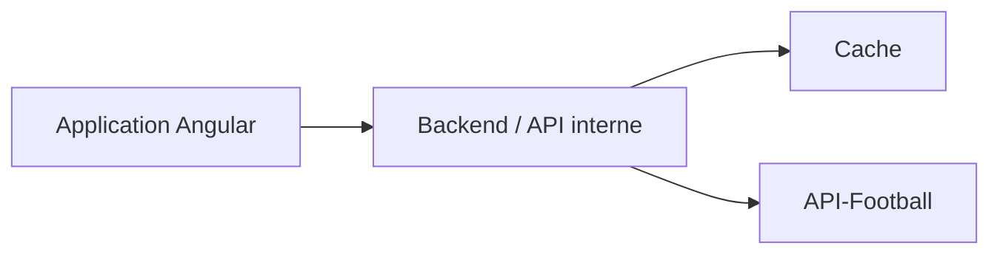
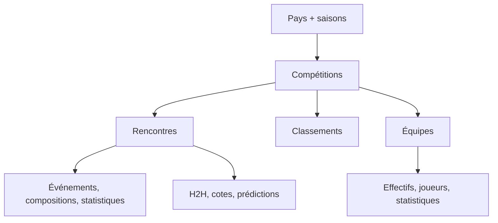
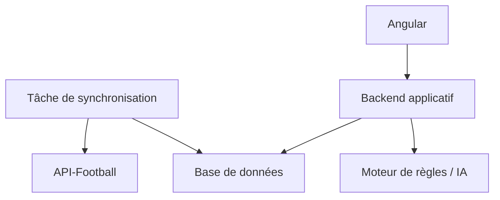

# API-Football — Documentation technique

> Guide d’intégration de l’API REST et des widgets API-Sports  
> Version du document : 30 juillet 2026

---

## 1. Présentation

API-Football est l’API football proposée par API-Sports. Elle fournit notamment :

- les pays, saisons et compétitions ;
- les équipes, stades et entraîneurs ;
- les calendriers et résultats des rencontres ;
- les classements ;
- les compositions, événements et statistiques de match ;
- les joueurs, effectifs, statistiques, blessures et transferts ;
- les confrontations directes ;
- les cotes et prédictions, selon la couverture de la compétition.

API-Sports propose deux modes d’intégration distincts :

1. **API REST** : l’application récupère les données brutes et construit sa propre interface et sa propre logique métier.
2. **Widgets** : des composants web prêts à l’emploi affichent directement matchs, classements, équipes ou joueurs.

Pour une application personnalisée d’aide à la décision, l’API REST est le socle principal. Les widgets sont surtout adaptés à un prototype rapide ou à des pages informatives standard.

---

## 2. Abonnements, quotas et limites

Tous les forfaits payants donnent accès à l’ensemble des compétitions et des endpoints. La différence principale porte sur le quota quotidien, les limites de débit et le nombre de membres autorisés dans une équipe.

| Forfait | Limite annoncée par minute |
|---|---:|
| Free | 10 requêtes/minute |
| Pro | 300 requêtes/minute |
| Ultra | 450 requêtes/minute |
| Mega | 900 requêtes/minute |
| Custom | 1 200 requêtes/minute |

Points importants :

- les limites exactes par minute et par seconde sont indiquées dans les en-têtes de chaque réponse ;
- le quota quotidien est remis à zéro chaque jour à **00:00 UTC** ;
- les requêtes inutilisées ne sont pas reportées au lendemain ;
- il n’y a pas de renouvellement automatique : à expiration, le compte repasse sur le forfait Free ;
- un dépassement important ou des pics anormaux peuvent provoquer un blocage temporaire ou permanent ;
- le nombre de *seats* correspond au nombre maximal de comptes partageant l’abonnement au sein d’une même équipe.

### 2.1 Règle d’architecture

Le quota ne doit jamais être géré depuis chaque écran indépendamment. Toutes les requêtes doivent passer par une couche centralisée capable de :

- mettre les réponses en cache ;
- empêcher les appels identiques simultanés ;
- respecter les limites de débit ;
- journaliser la consommation ;
- servir des données légèrement anciennes lorsque l’API est momentanément indisponible.

### 2.2 Stratégie de cache recommandée

| Type de données | Durée de cache indicative |
|---|---:|
| Fuseaux horaires | permanente |
| Saisons | 24 heures |
| Pays | 24 heures |
| Compétitions et couverture | 24 heures |
| Équipes, stades, entraîneurs | 24 heures |
| Classements sans match en cours | 24 heures |
| Classements avec match en cours | 1 heure |
| Matchs futurs | 15 à 60 minutes |
| Matchs en direct | selon besoin, sans descendre sous les limites autorisées |
| Statistiques historiques | longue durée, voire permanente après validation |
| Logos et images | cache local ou CDN longue durée |

Ces durées sont des recommandations d’architecture. Les fréquences officielles propres à chaque endpoint restent la référence.

---

## 3. Authentification REST

La clé API est transmise dans l’en-tête HTTP :

```http
x-apisports-key: VOTRE_CLE_API
```

Exemple :

```bash
curl --request GET \
  --url "https://v3.football.api-sports.io/leagues?country=France&season=2025" \
  --header "x-apisports-key: VOTRE_CLE_API"
```

### 3.1 Sécurité

Pour une application Angular personnalisée, la clé ne doit pas être intégrée dans :

- le code TypeScript ;
- les fichiers `environment.ts` compilés ;
- le stockage local du navigateur ;
- les paramètres d’URL ;
- un dépôt Git.

Le navigateur doit appeler votre backend. Le backend appelle ensuite API-Football avec la clé conservée dans une variable d’environnement.



Le cache peut être intégré au backend pour le MVP, puis déplacé vers Redis ou une solution équivalente si la charge augmente.

---

## 4. Modèle général des données

Le diagramme fourni par API-Football montre que les compétitions structurent une grande partie des données.



Principes à retenir :

- l’identifiant d’une compétition est stable entre les saisons ;
- l’identifiant d’une équipe est stable entre les compétitions auxquelles elle participe ;
- l’identifiant d’un stade est unique ;
- une saison est représentée par son année de début ;
- la disponibilité réelle des données dépend de la **couverture** de chaque compétition.

Exemple : la saison anglaise 2025-2026 est identifiée par `2025`.

---

## 5. Endpoints de référence

### 5.1 Fuseaux horaires

**Endpoint logique :** `timezone`

Renvoie les fuseaux horaires utilisables avec les rencontres.

- Paramètre : aucun
- Mise à jour : aucune
- Appel recommandé : une seule fois lorsque nécessaire

Le fuseau doit être explicitement choisi pour éviter les décalages entre UTC, l’heure de Paris et l’heure locale d’une compétition.

---

### 5.2 Pays

**Endpoint logique :** `countries`

Renvoie les pays disponibles pour la recherche des compétitions.

| Paramètre | Type | Description |
|---|---|---|
| `name` | chaîne | Nom exact du pays |
| `code` | chaîne de 2 à 6 caractères | Code, par exemple `FR`, `GB-ENG`, `IT` |
| `search` | chaîne de 3 caractères | Recherche sur le nom |

- Mise à jour : lorsqu’un pays nouvellement couvert est ajouté
- Appel recommandé : une fois par jour

URL d’un drapeau :

```text
https://media.api-sports.io/flags/{country_code}.svg
```

---

### 5.3 Compétitions

**Endpoint logique :** `leagues`

Renvoie les championnats et coupes disponibles.

| Paramètre | Type | Description |
|---|---|---|
| `id` | entier | Identifiant de la compétition |
| `name` | chaîne | Nom |
| `country` | chaîne | Pays |
| `code` | chaîne | Code pays |
| `season` | entier `YYYY` | Saison |
| `team` | entier | Compétitions auxquelles participe une équipe |
| `type` | `league` ou `cup` | Type de compétition |
| `current` | booléen textuel | Filtre sur les saisons actives |
| `search` | chaîne, 3 caractères minimum | Recherche par nom ou pays |
| `last` | entier sur 2 chiffres maximum | Dernières compétitions ajoutées |

Logo d’une compétition :

```text
https://media.api-sports.io/football/leagues/{league_id}.png
```

La réponse contient également la **couverture** de la compétition. Elle indique si les fonctionnalités suivantes sont disponibles : statistiques, classements, joueurs, blessures, prédictions, cotes, etc.

> Une valeur de couverture à `false` avant le début d’une compétition ne signifie pas nécessairement que cette donnée ne sera jamais disponible. La couverture peut être actualisée lorsque la compétition commence.

---

### 5.4 Saisons

**Endpoint logique :** `leagues/seasons`

Renvoie toutes les saisons connues.

- Paramètre : aucun
- Format : année sur quatre chiffres
- Mise à jour : lors de l’ajout d’une saison
- Appel recommandé : une fois par jour

---

### 5.5 Équipes

**Endpoint logique :** `teams`

Renvoie les équipes disponibles. Au moins un paramètre est obligatoire.

| Paramètre | Type | Description |
|---|---|---|
| `id` | entier | Identifiant de l’équipe |
| `name` | chaîne | Nom |
| `league` | entier | Identifiant de compétition |
| `season` | entier `YYYY` | Saison |
| `country` | chaîne | Pays |
| `code` | chaîne de 3 caractères | Code de l’équipe |
| `venue` | entier | Identifiant du stade |
| `search` | chaîne, 3 caractères minimum | Recherche par nom d’équipe ou pays |

- Mise à jour : plusieurs fois par semaine
- Appel recommandé : une fois par jour

Logo d’une équipe :

```text
https://media.api-sports.io/football/teams/{team_id}.png
```

---

### 5.6 Saisons d’une équipe

**Endpoint logique :** `teams/seasons`

| Paramètre | Obligatoire | Description |
|---|---|---|
| `team` | oui | Identifiant de l’équipe |

- Mise à jour : plusieurs fois par semaine
- Appel recommandé : une fois par jour

---

### 5.7 Pays des équipes

**Endpoint logique :** `teams/countries`

Renvoie les pays disponibles pour l’endpoint des équipes.

- Paramètre : aucun
- Mise à jour : plusieurs fois par semaine
- Appel recommandé : une fois par jour

---

### 5.8 Stades

**Endpoint logique :** `venues`

Au moins un paramètre est obligatoire.

| Paramètre | Type | Description |
|---|---|---|
| `id` | entier | Identifiant du stade |
| `name` | chaîne | Nom |
| `city` | chaîne | Ville |
| `country` | chaîne | Pays |
| `search` | chaîne, 3 caractères minimum | Recherche sur le nom, la ville ou le pays |

- Mise à jour : plusieurs fois par semaine
- Appel recommandé : une fois par jour

Image d’un stade :

```text
https://media.api-sports.io/football/venues/{venue_id}.png
```

---

### 5.9 Classements

**Endpoint logique :** `standings`

Renvoie un ou plusieurs classements. Une compétition peut avoir plusieurs tableaux : groupes, phases d’ouverture et de clôture, etc.

| Paramètre | Obligatoire | Description |
|---|---|---|
| `season` | oui | Saison au format `YYYY` |
| `league` | selon la recherche | Identifiant de compétition |
| `team` | non | Identifiant d’équipe |

- Mise à jour : toutes les heures
- Appel recommandé : une fois par heure lorsqu’un match est en cours, sinon une fois par jour

Ne jamais supposer que la réponse contient un tableau unique. Le modèle interne doit accepter plusieurs groupes de classement.

---

### 5.10 Statistiques d’une équipe

L’extrait fourni décrit un endpoint nécessitant :

| Paramètre | Obligatoire | Description |
|---|---|---|
| `league` | oui | Identifiant de compétition |
| `season` | oui | Saison |
| `team` | oui | Identifiant d’équipe |
| `date` | non | Date limite au format `YYYY-MM-DD` |

Cet endpoint est central pour construire des indicateurs tels que :

- bilan général, domicile et extérieur ;
- buts marqués et encaissés ;
- séries en cours ;
- clean sheets ;
- répartition temporelle des buts ;
- forme récente ;
- comparaisons attaque/défense.

Le paramètre `date` est particulièrement important pour une analyse historique fiable : il permet d’éviter d’utiliser des informations postérieures à la rencontre analysée.

---

## 6. Rencontres et données dérivées

Le schéma API-Football rattache aux rencontres :

- les événements ;
- les compositions ;
- les statistiques de match ;
- les confrontations directes ;
- les prédictions ;
- les blessures ;
- le direct ;
- les cotes avant match et en direct.

Ces endpoints ne sont pas détaillés dans l’extrait source fourni. Avant implémentation, leurs paramètres et leur couverture doivent être confirmés dans la documentation officielle correspondant à la version utilisée.

Pour le produit envisagé, la rencontre constitue l’agrégat principal :

```ts
interface MatchAnalysis {
  fixtureId: number;
  leagueId: number;
  season: number;
  kickoff: string;
  timezone: string;
  homeTeamId: number;
  awayTeamId: number;
  standings?: StandingsSnapshot;
  homeStatistics?: TeamStatisticsSnapshot;
  awayStatistics?: TeamStatisticsSnapshot;
  injuries?: Injury[];
  odds?: OddsSnapshot;
}
```

Le suffixe `Snapshot` est volontaire : les données utilisées pour décider doivent être conservées telles qu’elles étaient au moment de l’analyse.

---

## 7. Logos, images et droits

Les appels vers les logos et images ne sont pas décomptés du quota quotidien. Ils restent néanmoins soumis à des limites par seconde et par minute.

API-Sports recommande de stocker ces médias de son côté, par exemple avec un CDN tel que BunnyCDN, afin :

- de ne pas ralentir l’interface ;
- de limiter la dépendance au service média ;
- d’éviter des appels répétés ;
- de mieux contrôler le cache et les performances.

### 7.1 Limite juridique

API-Sports fournit ces visuels à des fins d’identification et de description, mais n’en revendique pas la propriété intellectuelle.

L’éditeur de l’application reste responsable :

- de vérifier les droits applicables aux logos, marques et images ;
- d’obtenir les licences éventuellement nécessaires ;
- de respecter la législation des pays dans lesquels le service est proposé.

Le fait qu’un média soit techniquement accessible via l’API ne constitue pas une autorisation commerciale automatique.

---

## 8. Widgets API-Sports

### 8.1 Widgets disponibles

| Widget | Fonction |
|---|---|
| `games` | Liste des rencontres |
| `game` | Détail d’une rencontre |
| `team` | Profil d’une équipe |
| `player` | Profil d’un joueur |
| `standings` | Classement |
| `league` | Calendrier d’une compétition |
| `leagues` | Liste des compétitions |
| `h2h` | Confrontations directes |

Les widgets `races`, `race` et `driver` concernent la Formule 1 ; `fights`, `fight` et `fighter` concernent le MMA.

### 8.2 Installation

Insérer une seule fois le script :

```html
<script
  type="module"
  src="https://widgets.api-sports.io/3.1.0/widgets.js">
</script>
```

Puis ajouter une configuration globale unique :

```html
<api-sports-widget
  data-type="config"
  data-key="VOTRE_CLE_API"
  data-sport="football"
  data-lang="fr"
  data-theme="white"
  data-timezone="Europe/Paris"
  data-show-logos="true">
</api-sports-widget>
```

Tous les autres widgets héritent de cette configuration, sauf lorsqu’une valeur est redéfinie localement.

### 8.3 Paramètres globaux

| Attribut | Défaut | Valeurs ou rôle |
|---|---|---|
| `data-type` | — | Doit valoir `config` |
| `data-key` | — | Clé API |
| `data-sport` | `football` | Sport sélectionné |
| `data-url-[sport]` | — | URL API personnalisée pour le sport |
| `data-lang` | `en` | `en`, `fr`, `es`, `it` |
| `data-custom-lang` | — | URL d’un fichier JSON de traduction |
| `data-theme` | `white` | `white`, `grey`, `dark`, `blue`, ou thème personnalisé |
| `data-timezone` | `utc` | Fuseau utilisé |
| `data-show-logos` | `false` | Affichage des logos |
| `data-logo-url` | — | URL de base personnalisée pour les logos |
| `data-show-errors` | `false` | Erreurs dans la console |
| `data-favorite` | `false` | Activation des favoris |

La fonctionnalité de favoris utilise des cookies. Elle ne doit être activée qu’après gestion du consentement applicable.

---

## 9. Navigation dynamique entre widgets

Les attributs `data-target-*` déterminent où afficher un widget ouvert depuis un autre composant.

Deux possibilités :

- `modal` : ouverture dans une fenêtre modale ;
- sélecteur CSS : injection dans un élément comme `#details` ou `.container`.

Attributs football et sports généraux :

- `data-target-game`
- `data-target-standings`
- `data-target-team`
- `data-target-player`
- `data-target-league`

Exemple avec un conteneur :

```html
<api-sports-widget data-type="games"></api-sports-widget>

<div id="details"></div>

<api-sports-widget
  data-type="config"
  data-key="VOTRE_CLE_API"
  data-sport="football"
  data-target-game="#details">
</api-sports-widget>
```

Exemple avec une modale :

```html
<api-sports-widget data-type="games"></api-sports-widget>

<api-sports-widget
  data-type="config"
  data-key="VOTRE_CLE_API"
  data-sport="football"
  data-target-game="modal">
</api-sports-widget>
```

---

## 10. Configuration détaillée des widgets

### 10.1 Widget `league`

| Attribut | Obligatoire | Description |
|---|---|---|
| `data-type="league"` | oui | Type |
| `data-league` | oui | Identifiant de compétition |
| `data-season` | non | Saison ; dernière saison par défaut |
| `data-tab` | non | `today`, `results`, `games`, `standings` |
| `data-standings` | non | Active le classement |
| `data-target-game` | non | `modal` ou sélecteur CSS |
| `data-refresh` | non | `true`, `false` ou nombre de secondes ≥ 15 |

### 10.2 Widget `games`

| Attribut | Défaut | Description |
|---|---|---|
| `data-type="games"` | — | Type obligatoire |
| `data-date` | — | Date `YYYY-MM-DD` |
| `data-league` | — | Un ou plusieurs IDs séparés par des tirets |
| `data-country` | — | Filtre pays |
| `data-refresh` | — | Actualisation, minimum 15 secondes |
| `data-show-toolbar` | `false` | Barre supérieure |
| `data-tab` | automatique | `all`, `live`, `finished`, `scheduled` |
| `data-games-style` | `1` | Affichage sur une ou deux lignes |
| `data-target-game` | — | Détails de rencontre |
| `data-target-standings` | — | Classement |

Exemple :

```html
<api-sports-widget
  data-type="games"
  data-date="2026-07-30"
  data-league="39-61-78-135-140"
  data-tab="scheduled"
  data-games-style="2"
  data-target-game="modal">
</api-sports-widget>
```

### 10.3 Widget `h2h`

| Attribut | Obligatoire | Description |
|---|---|---|
| `data-type="h2h"` | oui | Type |
| `data-h2h` | oui | Deux IDs d’équipes, par exemple `33-34` |
| `data-target-game` | non | Détails de rencontre |
| `data-target-standings` | non | Classement |

### 10.4 Widget `standings`

| Attribut | Obligatoire | Description |
|---|---|---|
| `data-type="standings"` | oui | Type |
| `data-league` | oui | Identifiant de compétition |
| `data-season` | oui | Saison |
| `data-target-team` | non | Profil d’équipe |

### 10.5 Widget `team`

| Attribut | Défaut | Description |
|---|---|---|
| `data-type="team"` | — | Type obligatoire |
| `data-team-id` | — | ID obligatoire |
| `data-team-tab` | automatique | `statistics`, `squads`, `venue` |
| `data-team-statistics` | `false` | Statistiques |
| `data-team-squad` | `false` | Effectif |
| `data-target-player` | — | Profil joueur |

L’effectif est pris en charge pour Football, Basketball, NBA, AFL et NFL. La navigation vers un joueur est prise en charge pour Football, NBA, AFL et NFL.

### 10.6 Widget `player`

| Attribut | Défaut | Description |
|---|---|---|
| `data-type="player"` | — | Type obligatoire |
| `data-player-id` | — | ID obligatoire |
| `data-season` | — | Nécessaire pour certaines fonctions |
| `data-player-statistics` | `false` | Statistiques |
| `data-player-trophies` | `false` | Trophées, Football uniquement |
| `data-player-injuries` | `false` | Blessures, nécessite la saison |

---

## 11. Langues et traductions

Langues intégrées :

- `en` : anglais ;
- `fr` : français ;
- `es` : espagnol ;
- `it` : italien.

```html
<api-sports-widget
  data-type="config"
  data-key="VOTRE_CLE_API"
  data-sport="football"
  data-lang="fr">
</api-sports-widget>
```

Un fichier JSON personnalisé peut surcharger les libellés :

```json
{
  "all": "Tous",
  "live": "En direct",
  "finished": "Terminés",
  "scheduled": "À venir",
  "favorites": "Favoris"
}
```

```html
<api-sports-widget
  data-type="config"
  data-key="VOTRE_CLE_API"
  data-sport="football"
  data-lang="fr"
  data-custom-lang="https://example.com/lang/fr-custom.json">
</api-sports-widget>
```

Lorsqu’une clé existe dans la langue intégrée et dans le fichier personnalisé, le fichier personnalisé est prioritaire.

---

## 12. Thèmes

Thèmes prédéfinis :

- `white` ;
- `grey` ;
- `dark` ;
- `blue`.

Un thème personnalisé se construit avec les variables CSS exposées par les composants :

```css
api-sports-widget[data-theme="DecisionApp"] {
  --primary-color: #18cfc0;
  --success-color: #2ecc58;
  --warning-color: #f39c12;
  --danger-color: #e74c3c;
  --light-color: #898989;

  --home-color: var(--primary-color);
  --away-color: #ffc107;

  --text-color: #333;
  --text-color-info: #333;
  --background-color: #fff;

  --primary-font-size: 0.72rem;
  --secondary-font-size: 0.75rem;
  --button-font-size: 0.8rem;
  --title-font-size: 0.9rem;

  --border: 1px solid #95959530;
  --game-height: 2.3rem;
  --league-height: 2.35rem;
  --score-size: 2.25rem;
  --flag-size: 22px;
  --teams-logo-size: 18px;
  --teams-logo-size-xl: 5rem;
  --hover: rgba(200, 200, 200, 0.15);
}
```

```html
<api-sports-widget
  data-type="config"
  data-key="VOTRE_CLE_API"
  data-sport="football"
  data-theme="DecisionApp">
</api-sports-widget>
```

---

## 13. API REST ou widgets ?

| Critère | API REST | Widgets |
|---|---|---|
| Mise en place | Plus longue | Très rapide |
| Personnalisation visuelle | Totale | Encadrée par le composant |
| Logique métier | Totale | Limitée |
| Protection de la clé | Via backend | Clé configurée côté page |
| Mise en cache | Contrôlée par l’application | Moins maîtrisée |
| Calcul d’indicateurs propres | Oui | Non |
| Prototype de scores et classements | Possible, mais plus coûteux | Excellent |
| Produit d’aide à la décision | Recommandé | Insuffisant seul |

### Décision recommandée

Pour le MVP d’aide à la décision :

- utiliser **l’API REST** pour les rencontres, classements, statistiques d’équipes et données servant à la priorisation ;
- utiliser éventuellement les **widgets** pour prototyper une page de détail ou valider rapidement la couverture ;
- ne pas construire le cœur du produit autour des widgets, car l’interface doit organiser les rencontres selon le profil de l’utilisateur et non reproduire un site de scores.

---

## 14. Architecture proposée pour le MVP



### 14.1 Synchronisation

Une tâche planifiée récupère :

1. les compétitions retenues ;
2. les rencontres de la période utile ;
3. les classements ;
4. les statistiques des équipes concernées ;
5. les données complémentaires réellement couvertes.

L’écran utilisateur lit ensuite la base interne, et non API-Football en direct à chaque affichage.

### 14.2 Données minimales à conserver

- identifiants API ;
- pays, compétition et saison ;
- date et statut de la rencontre ;
- équipes domicile et extérieur ;
- score et résultat ;
- classement au moment de l’analyse ;
- statistiques domicile/extérieur ;
- horodatage de récupération ;
- couverture disponible ;
- version ou instantané des indicateurs calculés.

### 14.3 Rôle de l’IA

L’IA ne doit pas remplacer la collecte structurée. Son rôle peut être de :

- interpréter les comportements et préférences de l’utilisateur ;
- rapprocher les caractéristiques d’une rencontre de son profil ;
- organiser et prioriser les opportunités ;
- détecter des contradictions ou signaux de risque ;
- produire une explication synthétique à partir de données déjà validées.

Les calculs factuels — classement, écart de forme, buts, séries, domicile/extérieur — doivent rester déterministes et auditables.

---

## 15. Gestion des erreurs et de la consommation

À chaque appel, enregistrer au minimum :

```ts
interface ApiCallLog {
  endpoint: string;
  requestedAt: string;
  statusCode: number;
  durationMs: number;
  cacheHit: boolean;
  remainingDailyQuota?: number;
  remainingMinuteQuota?: number;
}
```

Comportements attendus :

- ne pas relancer immédiatement une requête en boucle ;
- appliquer un délai progressif sur les erreurs temporaires ;
- ne pas réessayer automatiquement une erreur fonctionnelle liée aux paramètres ;
- utiliser la dernière donnée valide lorsque cela reste acceptable ;
- afficher la date de dernière actualisation dans les écrans sensibles ;
- désactiver ou espacer les synchronisations si le quota restant devient critique.

---

## 16. Checklist d’intégration

### API REST

- [ ] Conserver la clé uniquement côté serveur.
- [ ] Centraliser tous les appels.
- [ ] Lire les en-têtes de quota et de rate limit.
- [ ] Mettre en cache les référentiels.
- [ ] Vérifier la couverture de chaque compétition.
- [ ] Normaliser toutes les dates et tous les fuseaux.
- [ ] Conserver des instantanés historiques.
- [ ] Prévoir les classements à plusieurs groupes.
- [ ] Utiliser le paramètre de date lorsqu’il évite une fuite d’information future.
- [ ] Journaliser erreurs, latence et consommation.

### Widgets

- [ ] Charger le script une seule fois.
- [ ] Ajouter une seule configuration globale.
- [ ] Choisir explicitement la langue et le fuseau.
- [ ] Ne pas activer les favoris avant gestion du consentement aux cookies.
- [ ] Choisir entre modale et conteneur pour la navigation dynamique.
- [ ] Ne pas régler l’actualisation sous 15 secondes.
- [ ] Tester le thème personnalisé sur mobile et ordinateur.

### Médias

- [ ] Mettre logos et images en cache.
- [ ] Utiliser un CDN si le trafic le justifie.
- [ ] Vérifier les droits d’utilisation commerciale.
- [ ] Prévoir une image de remplacement.

---

## 17. Sources

- [Documentation officielle des widgets API-Sports](https://api-sports.io/documentation/widgets/v3)
- [Présentation officielle des widgets API-Sports](https://api-sports.io/widgets)
- Extrait de documentation API-Football et schéma des relations fournis avec la demande.

---

## 18. Limites du présent document

Cette version couvre précisément les éléments fournis : abonnements, limites, médias, widgets, fuseaux, pays, compétitions, saisons, équipes, stades, classements et paramètres de statistiques d’équipes.

Le schéma mentionne d’autres domaines — fixtures, événements, compositions, statistiques de match, joueurs, blessures, transferts, cotes et prédictions — mais leurs contrats REST détaillés n’étaient pas présents dans l’extrait. Ils devront faire l’objet d’un second chapitre avant l’implémentation complète du pipeline de données.
