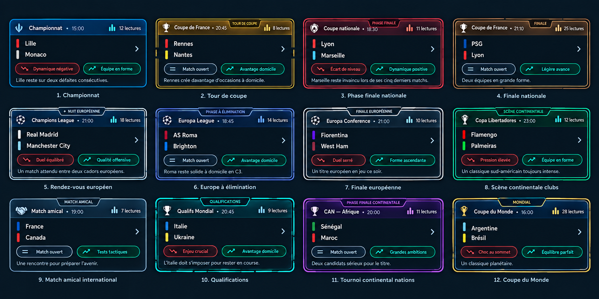
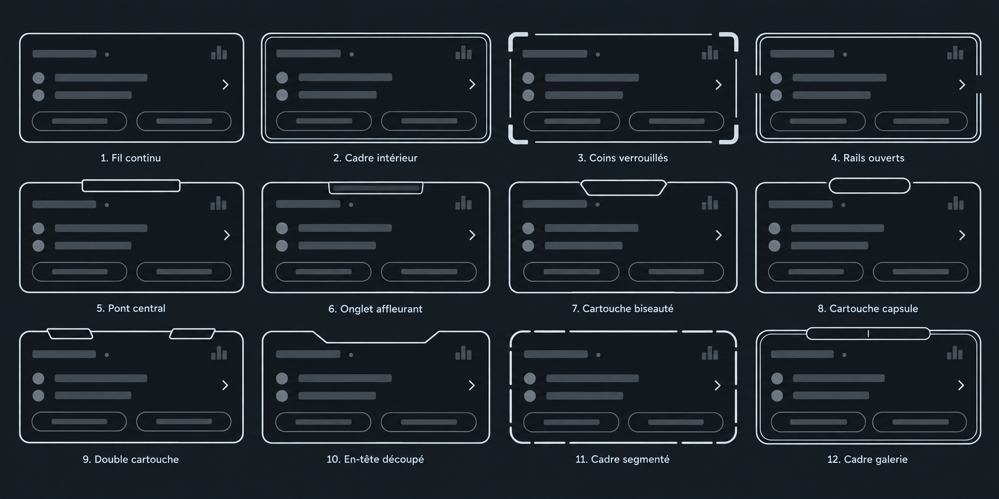
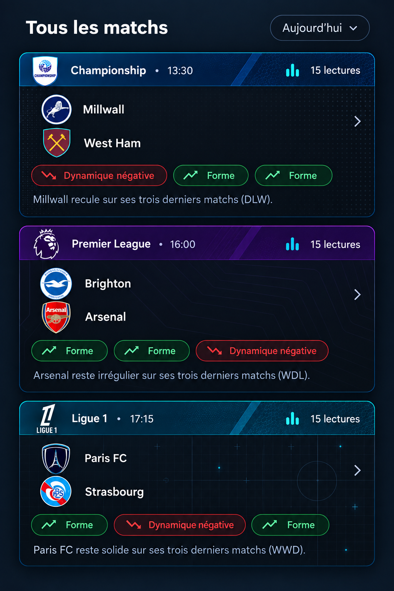

# Références visuelles des cartes de match

Ces visuels sont les références de conception à conserver pendant l’intégration et les évolutions ultérieures.

## Références contractuelles

### Langage complet des cartes

Cette planche définit la densité, la hiérarchie, les doubles bordures lumineuses et les cartouches réservées aux formats qui en ont besoin.

### Atlas des cadres et cartouches

Cet atlas définit la géométrie des formes ; un cadre ou une cartouche ne doit pas être réinterprété librement.

### Matière de bandeau

Cette référence définit la matière attendue pour le bandeau : lumière froide, facette brillante, microtrame technique et dégradé dense. Il ne s’agit pas de courbes décoratives posées sur une couleur unie.

Pour les championnats, le cadre de référence est celui de la carte **Coupe du Monde** de la planche des formats : double bordure lumineuse et cartouche centrale intégrée au sommet. La cartouche affiche la journée lorsque cette donnée est disponible. Elle reprend le tracé biseauté de la planche, avec son liseré intérieur : une capsule générique ou un simple rectangle ne sont pas conformes.

## Règles qui en découlent

- Les cartes retenues utilisent une double bordure visible, avec une bordure intérieure plus fine.
- Le bandeau horizontal porte le logo, la compétition, l’heure et le volume de lectures.
- La couleur appartient à la compétition ; sa texture est confinée au bandeau et reprend une matière froide, brillante et technique.
- Les cartouches apparaissent lorsque le format de la rencontre porte une information utile : pour un championnat, c’est la journée fournie par l’API ; pour les autres formats, le tour, l’élimination, la finale, la qualification ou la rencontre continentale.
- La matière glacée du bandeau associe un dégradé coloré dense, une facette claire diagonale, une lumière froide et une microtrame sur la droite. Elle reste légère afin de préserver la lisibilité du logo et des métadonnées.

## Prototype de contrôle

Le prototype sert à contrôler le rendu à l’échelle mobile avant toute intégration Flutter.
